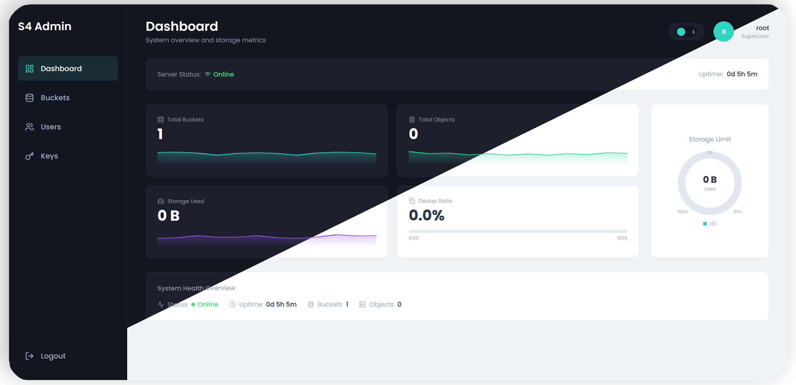

# S4 Console — Web Admin UI

Next.js 14 admin console for the S4 storage server.




**SERVER** s4core: http://63.141.251.44:10117

**WEB** s4console: http://63.141.251.44:24490

> Reset demo every 10 min


## Prerequisites

- Node.js 18+ (for local development)
- Docker & Docker Compose (for containerized deployment)
- S4 server running on `http://127.0.0.1:9000`

## Quick explan
┌────────────────────────────────────────┬────────────────────────────────────────────┐
│                  File                  │                Description                 │
├────────────────────────────────────────┼────────────────────────────────────────────┤
│ frontend/s4-console/Dockerfile         │ Multi-stage production build (~50MB image) │
├────────────────────────────────────────┼────────────────────────────────────────────┤
│ frontend/s4-console/docker-compose.yml │ Dev/Prod/Full-stack profiles               │
├────────────────────────────────────────┼────────────────────────────────────────────┤
│ frontend/s4-console/.dockerignore      │ Excludes node_modules, .next, etc.         │
├────────────────────────────────────────┼────────────────────────────────────────────┤
│ frontend/s4-console/public/.gitkeep    │ Empty public folder for Docker build       │
├────────────────────────────────────────┼────────────────────────────────────────────┤
│ frontend/README.md                     │ Updated with Docker instructions           │
├────────────────────────────────────────┼────────────────────────────────────────────┤
│ frontend/s4-console/next.config.js     │ Added output: 'standalone'                 │
└────────────────────────────────────────┴────────────────────────────────────────────┘
Usage:

# Development (hot reload)
docker compose up dev

# Production (optimized)
docker compose up prod --build

# Custom backend
S4_BACKEND_URL=http://192.168.1.100:9000 docker compose up prod --build


## QUICK START

### Local Development

```bash
cd frontend/s4-console
npm install
npm run dev
# Open http://localhost:3000
```

### Docker Development

```bash
cd frontend/s4-console
docker compose up dev
# Open http://localhost:3000
```

### Docker Production

```bash
cd frontend/s4-console
docker compose up prod --build
# Open http://localhost:3000
```

Login with your root credentials (set via `S4_ROOT_PASSWORD` when starting the server).

## Environment Variables

| Variable | Description | Default |
|----------|-------------|---------|
| `S4_BACKEND_URL` | S4 server URL for API proxy | `http://127.0.0.1:9000` |
| `NODE_TLS_REJECT_UNAUTHORIZED` | Set to `0` for self-signed certs (dev only) | - |
| `PORT` | Console listen port | `3000` |

## Docker

### Development Mode

Hot-reload enabled, mounts source code as volume:

```bash
# Start with default backend (http://host.docker.internal:9000)
docker compose up dev

# Custom backend URL
S4_BACKEND_URL=http://192.168.1.100:9000 docker compose up dev
```

### Production Mode

Multi-stage optimized build with standalone output:

```bash
# Build and run
docker compose up prod --build

# Or build image directly
docker build -t s4-console .
docker run -p 3000:3000 -e S4_BACKEND_URL=http://host.docker.internal:9000 s4-console
```

### Full Stack (S4 Server + Console)

Requires S4 server Docker image to be built first:

```bash
# Build S4 server image (from project root)
cd ../..
docker build -t s4-server .

# Run full stack
cd frontend/s4-console
S4_ROOT_PASSWORD=password12345 docker compose --profile full up
```

### TLS/HTTPS Backend

For S4 server with self-signed certificates:

```bash
# Local development
NODE_TLS_REJECT_UNAUTHORIZED=0 S4_BACKEND_URL=https://127.0.0.1:9000 npm run dev

# Docker development
docker compose up dev
# Then set environment in docker-compose.yml:
#   NODE_TLS_REJECT_UNAUTHORIZED: "0"
#   S4_BACKEND_URL: "https://host.docker.internal:9000"
```

## Production Build (without Docker)

```bash
npm run build
npm start
```

## Tech Stack

- Next.js 14 (App Router, TypeScript)
- Tailwind CSS (dark/light theming)
- Recharts (pie chart)
- Lucide React (icons)
- React Hot Toast (notifications)
- SWR (data fetching)

## Pages

| Route | Description |
|-------|-------------|
| `/login` | JWT authentication |
| `/` | Dashboard — system health, counters, storage distribution |
| `/buckets` | Bucket management (create, delete) |
| `/buckets/[name]` | Object browser with breadcrumb navigation |
| `/users` | IAM user management (CRUD) |
| `/keys` | S3 API key generation and management |

## API Proxy

The Next.js server proxies `/api/*` requests to the S4 backend. Configure the backend URL via `S4_BACKEND_URL` environment variable.

### Architecture

```
Browser -> Next.js (:3000) -> S4 Server (:9000)
              |
              +-- /api/* proxied to S4_BACKEND_URL
```

## Docker Image Details

The production Dockerfile uses a multi-stage build:

1. **deps** - Install production dependencies
2. **builder** - Build Next.js standalone output
3. **runner** - Minimal Alpine image (~50MB) with only necessary files

Security features:
- Non-root user (`nextjs:nodejs`)
- Read-only filesystem compatible
- No development dependencies in final image
